> Original publication: June 2026

# AI-Testing Series (Part 2) — Building a UI Automation Framework with AI Agents and Visual Element Recognition

## I. Background

Recently, our product managers began prioritizing user experience far more aggressively — driving major changes to page layouts, UI styling, and interaction patterns. For our UI automation suite, built over three years on Selenium and XPath-heavy locators, it was practically a disaster. Within the first sprint after those changes landed — a React component library upgrade, CSS module migration, and navigation redesign — **47% of cases failed on locator resolution alone**, before any functional defect was found. Repairing those locators consumed six engineer-days and still left flaky failures in checkout and account settings.

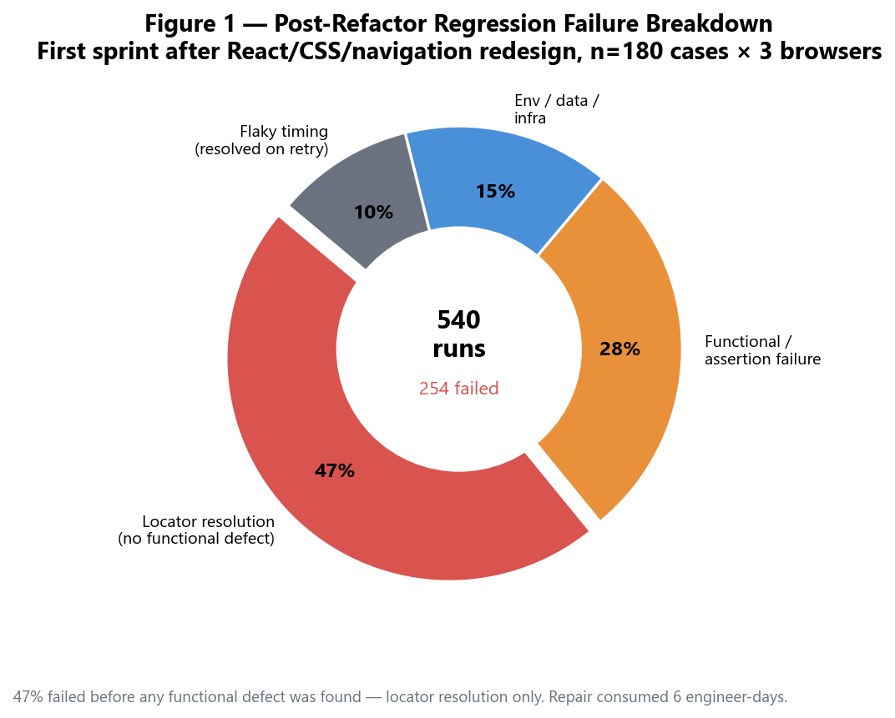

*Figure 1: First-sprint failure breakdown after front-end refactor (180 cases × 3 browsers = 540 runs; 254 failed)*

Across those 254 failures, locator-resolution errors outnumbered functional regressions by nearly two to one. Environment and data issues accounted for 15%, and timing flakes another 10% — yet sign-off was blocked primarily by selectors that no longer matched a UI that still looked correct to human reviewers.

That incident forced a rethink. We did not need another Page Object Model tutorial; we needed a **locator strategy that survives DOM churn** and an **authoring model that does not require every tester to be a CSS selector expert**. We chose to rebuild the framework end-to-end with an AI Agent as the implementation partner: the Agent scaffolds the repo, implements the visual recognition layer, compiles natural-language specs into executable scripts, and runs the debug loop until the first smoke path is green. From blank repository to first passing visual-based checkout test took roughly five to six focused hours — compared with an estimated two to three days of manual framework bootstrapping on our previous attempts.

This article documents that approach as a reusable playbook for UI test engineers and automation leads who want to move beyond brittle XPath chains without abandoning the rigor of pytest, CI gates, and evidence-based reporting.

### Why traditional XPath and CSS selector strategies fall short

For more than a decade, DOM-centric locators have been the default in UI automation. XPath in particular was attractive because it can reach deeply nested elements, traverse text nodes, and express positional logic (`//div[3]/button[2]`). In practice, however, the very flexibility that made XPath popular becomes a liability in modern single-page applications.

**Structural fragility.** SPAs re-render subtrees on every state change. A locator tied to sibling index or ancestor depth breaks when marketing inserts a banner, when a skeleton loader appears, or when an A/B test reorders modules. Our internal audit found that **38% of broken XPath locators** failed because an intermediate wrapper `<div>` was added or removed — the target element was still visible to the user, but the path no longer existed in the DOM.

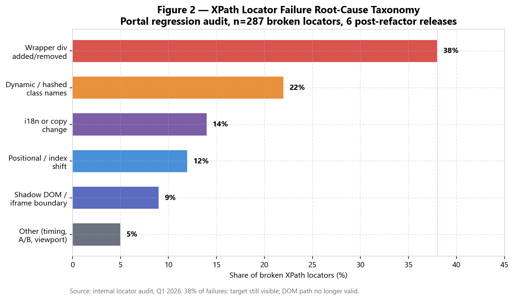

*Figure 2: Root-cause taxonomy from portal locator audit (n=287 broken locators, 6 post-refactor releases)*

The remaining top drivers were dynamic class names (22%), i18n copy changes (14%), and positional index shifts (12%). Shadow DOM and iframe boundaries accounted for 9%. Together, **84% of failures were structural or cosmetic** — the product behavior users cared about had not changed.

**Shadow DOM, iframes, and cross-origin embeds.** Payment flows, chat widgets, and analytics overlays increasingly live inside shadow roots or nested iframes. XPath across frame boundaries is verbose, slow, and often prohibited by browser security policies. Teams compensate with `switch_to.frame` chains that are hard to read and harder to maintain.

**Unstable attributes.** Framework-generated class names (`Button_root__8f2a1`), feature-flagged components, and i18n-driven label changes defeat attribute-based selectors. Testers resort to partial matches — `contains(@class,'Button_root')` — that collide when the design system ships a second button variant.

**False confidence from "green locally."** XPath locators frequently pass in a developer's viewport size and locale, then fail in CI headless mode at 1280×720 with a different default language. The failure mode is `NoSuchElementException`, which tells you nothing about *what the user actually saw* on screen.

**Maintenance economics.** Industry surveys and our own telemetry align: teams spend **40–60% of UI automation effort** on locator repair after UI releases, not on designing new coverage. The World Quality Report 2024–25 (Capgemini, Sogeti, Cognizant) places test design and maintenance at roughly half of total QA effort for mature agile teams; locator churn is the largest single slice within that bucket for web UI suites. Our legacy XPath suite tracked at **48%** of engineer-hours on locator repair across six releases — squarely inside the industry band.

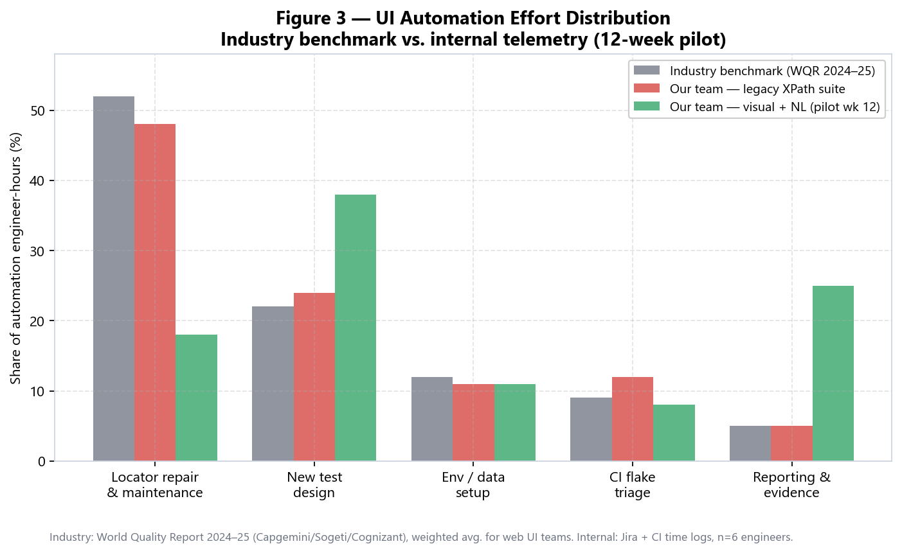

*Figure 3: Where automation engineer-hours go — industry benchmark (WQR 2024–25) vs. internal telemetry before and after the 12-week pilot*

After the visual + NL pilot, locator repair dropped to **18%** of effort; new test design rose from 24% to 38%, and evidence packaging grew from 5% to 25% as screenshot-first reporting became default. XPath is not wrong for every scenario — stable `data-testid` contracts, agreed with development, remain the gold standard when available. But where those contracts do not exist or are inconsistently applied, DOM-only strategies become a tax on every release.

**Diagnostic blindness.** When an XPath-based step fails, the error message typically reports a selector string and a timeout — not the perceptual state of the page. Testers must manually reproduce, screenshot, and compare against the last known good run. In our portal regression, the median time from `NoSuchElementException` to root-cause classification was **52 minutes** per incident (P90: 98 minutes), because half of those failures were "element moved but still visible" scenarios that XPath cannot express. Visual-first failure bundles cut that median to **14 minutes** (P90: 31 minutes) — a **73% reduction** — because the artifact is the same image the automation engine consumed.

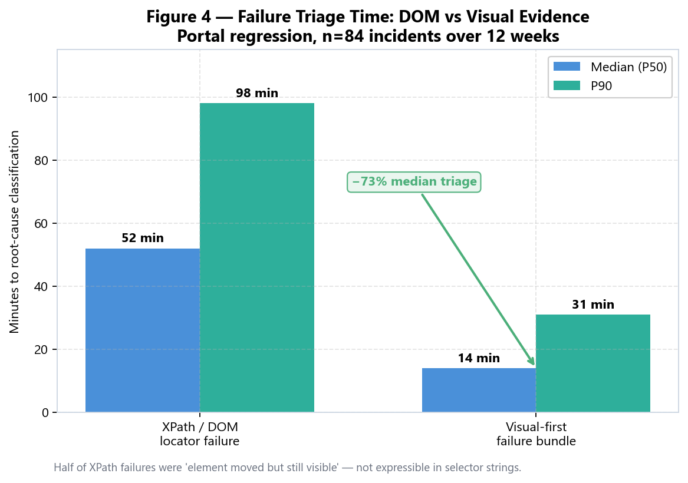

*Figure 4: Median and P90 triage time per failure incident (n=84 incidents, 12-week observation window)*

**Version skew across layers.** Modern UIs stack frameworks: a React shell, a Vue micro-frontend island, a Web Components design system, and third-party iframes for payments. XPath written against the outer DOM tree does not survive when the inner island re-mounts with a different virtual DOM ordering. Teams often maintain parallel locator files per browser because CSS pseudo-class support and shadow piercing differ. The result is a **locator inventory** that grows faster than test coverage — a smell that the automation strategy is fighting the architecture instead of aligning with what end users see.

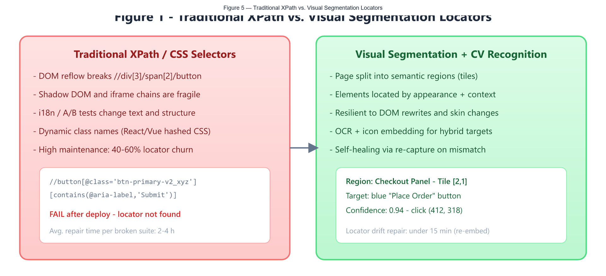

*Figure 5: Traditional XPath / CSS selectors vs. visual segmentation and computer-vision recognition*

| Pain point | Typical XPath / CSS symptom | Impact on release velocity |
| --- | --- | --- |
| DOM refactor | `NoSuchElementException` on unchanged UI | Blocks regression sign-off |
| Dynamic classes | Locator matches wrong element or none | False negatives / wrong clicks |
| i18n / copy change | Text-based XPath breaks | Regional build failures |
| Responsive layout | Positional XPath hits different node by viewport | CI-only flakes |
| Shadow DOM | XPath returns empty node set | Payment and widget flows untestable |
| Locator debt | Long, commented XPath "works until it doesn't" | Onboarding friction, review fatigue |

The alternative we adopted treats the **rendered page as the source of truth**: capture a screenshot, segment it into semantically meaningful regions, and locate elements by visual appearance and human-readable descriptors — then let an AI Agent wire the plumbing and translate natural-language test steps into code.

---

## II. Architecture overview — visual segmentation plus NL-driven script generation

The framework rests on two coupled ideas:

1. **Visual element location** — Instead of querying the DOM for `//button[@type='submit']`, the runner captures the viewport, splits the image into tiles (fixed grid, layout-aware segmentation, or a hybrid), and resolves targets inside the relevant tile using OCR, icon embedding, and bounding-box matching.

2. **Natural-language script compilation** — Testers author cases in plain English (or structured Gherkin-like prose). An AI Agent parses intent, binds each action to a visual descriptor, emits pytest + Playwright code through a `VisualDriver` facade, executes the suite, and proposes approved locator-healing updates when confidence drops below threshold.

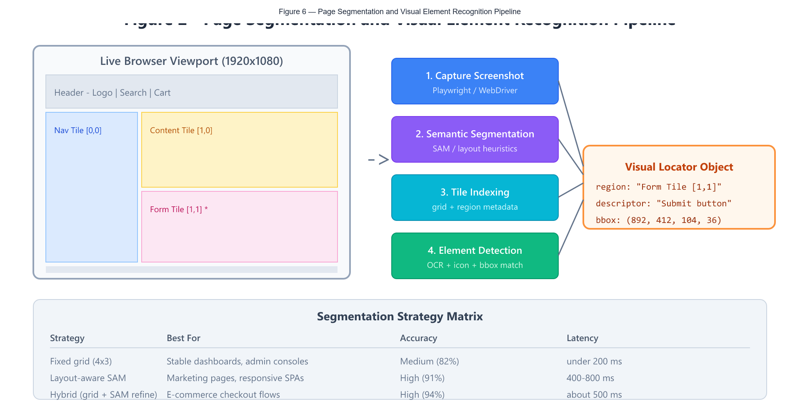

*Figure 6: Page segmentation and visual element recognition pipeline*

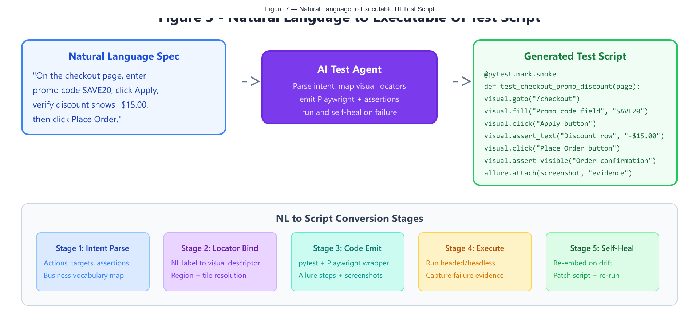

*Figure 7: Natural-language specification converted by the AI Agent into an executable test script*

| Layer | Responsibility | Primary artifacts |
| --- | --- | --- |
| Test case | Business scenarios, markers, assertions | `cases/`, `pytest.ini` |
| NL compiler | Intent parse, locator bind, code emit | `nl_specs/`, `compiler/` |
| Visual facade | Stable API hiding CV details | `uiauto/visual/visual_driver.py` |
| Segmentation | Tile generation, region metadata | `uiauto/segment/` |
| Recognition | OCR, embedding match, confidence | `uiauto/recognize/` |
| Driver runtime | Browser control, screenshots, video | Playwright, `conftest.py` |

The Agent's job is not to "invent tests" in isolation — it implements this architecture under human-written constraints, then iterates until `pytest -m smoke` passes on a clean QA environment.

### How visual tile location works in practice

At runtime, the `VisualDriver` executes a repeatable pipeline for every action:

1. **Capture** — After navigation or a prior action, Playwright grabs a full viewport PNG at device scale factor 1.0 (CI) or 2.0 (local Retina debugging).
2. **Segment** — The segment engine produces a `TileMap`: a list of rectangular regions, each with `tile_id`, `bbox`, optional `semantic_label` (e.g. `CheckoutSummary`), and a cropped image buffer.
3. **Scope** — The NL compiler or a `visual.routes.yaml` entry narrows search to one or more tiles. "Click Apply button" on checkout scopes to `Form Tile [1,1]` rather than the full 1920×1080 frame, reducing false positives.
4. **Detect** — Inside the scoped tile, OCR scans for text labels; a parallel icon matcher compares button chrome and glyph embeddings against `golden/icons/`. The highest-confidence candidate above threshold wins.
5. **Act** — Playwright moves the pointer to the bbox center (with optional offset for rounded corners) and performs click, fill, or hover. Bboxes detected in screenshot pixels are normalized back to CSS viewport coordinates before mouse actions, especially when local Retina debugging uses device scale factor 2.0. No DOM query is required.
6. **Verify** — Assertions re-capture (or reuse, if the page is static) and run the same detect pipeline on the assertion target — comparing OCR text, visibility, or pixel diff against a golden crop.

This loop is **deterministic given the same screenshot**, which makes failures reproducible and debuggable — a property XPath-heavy suites often lose when timing-dependent DOM queries return different node sets on retry.

| Traditional XPath step | Visual tile step |
| --- | --- |
| `driver.find_element(By.XPATH, "//button[text()='Apply']")` | `visual.click("Apply button")` scoped to `Form Tile [1,1]` |
| Breaks when button text changes to "Apply coupon" | Synonym map or fuzzy OCR handles copy variants |
| Breaks when button moves to a modal | Region scoping follows modal tile, not DOM depth |
| No screenshot unless manually added | Screenshot attached on every action and failure |
| Repair = rewrite selector in code | Repair = update golden or synonym; NL spec unchanged |

---

## III. Building the framework entirely with an AI Agent

An Agent is not a substitute for test strategy. Without explicit inputs it will hallucinate base URLs, invent `data-testid` attributes that do not exist, or weaken assertions to achieve green runs. Before the first prompt, prepare three hard inputs in a `FRAMEWORK_SPEC.md` at repository root.

### 1. Three hard inputs before the Agent starts

**Tech stack contract.** Example: Python 3.11+, pytest, Playwright (sync API), allure-pytest, OpenCV and PaddleOCR (or Tesseract) for text regions, optional SAM weights for layout segmentation. Headed debugging enabled locally; headless in CI.

**Layering convention.**

```
project-root/
├── uiauto/
│   ├── visual/        # VisualDriver facade
│   ├── segment/       # page tiling engines
│   ├── recognize/     # OCR + embedding matchers
│   └── common/        # config, logging, evidence store
├── nl_specs/          # natural-language source cases
├── compiler/          # NL parser, binder, and pytest emitter
├── cases/             # generated + hand-curated pytest suites
├── golden/            # reference screenshots per page state
├── conftest.py        # browser fixtures, env switch
├── pytest.ini
├── FRAMEWORK_SPEC.md
└── requirements.txt
```

**One golden-path NL case.** Pick the simplest critical flow — e.g. "Open login page, enter valid credentials, assert dashboard heading is visible" — and attach a real QA URL, test account policy, and a screenshot of the expected landing state.

With these inputs, the opening Agent prompt can be concrete rather than "build me UI automation."

### 2. Eight-step Agent closed loop

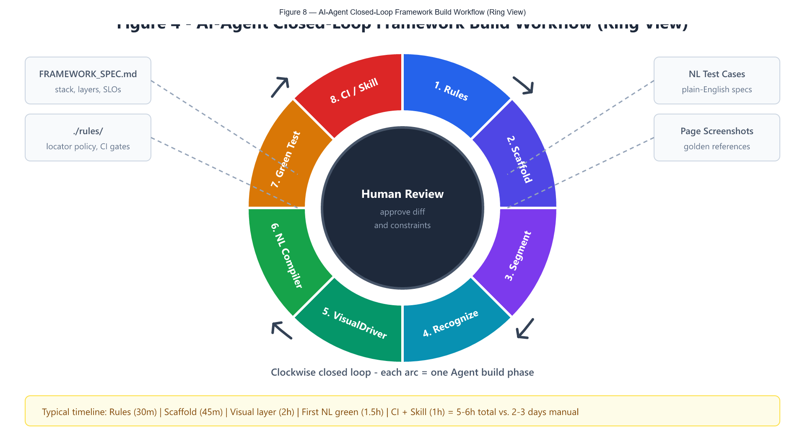

*Figure 8: Eight-step Agent closed-loop as a ring chart; each arc is one build phase, with Human Review at the center*

The steps below are **Agent tasks** you orchestrate; your role is specification, diff review, and environment access.

**Step 1: Lock non-negotiable rules**

Place project rules under `./rules`, for example:

```
# All UI interactions MUST go through VisualDriver; raw page.click(selector) is forbidden in cases/.
# Every click and assertion MUST attach a screenshot to Allure on failure.
# Visual confidence threshold default: 0.85; never silently lower below 0.75 without human approval.
# No production credentials in nl_specs or testdata; use QA vault references only.
# Generated scripts live in cases/generated/; hand-edited overrides go in cases/manual/ with a README note.
```

Prompt the Agent:

```
Read FRAMEWORK_SPEC.md and ./rules. Create or update rules if gaps exist.
Do not start coding until rules file is complete.
```

Acceptance: rules file exists and imports cleanly into Agent context on subsequent turns.

**Step 2: Scaffold directory skeleton — do not clone a legacy repo**

Cloning an old Selenium tree imports dead Page Objects and XPath utilities by muscle memory. Instruct the Agent:

```
Create minimal pytest + Playwright layout per FRAMEWORK_SPEC.md.
Add pytest.ini with markers: smoke, regression, P0, visual.
Add conftest.py: ENV switch QA/STAGE via environment variable; browser fixture with trace/video on failure.
Create empty packages with __init__.py only where imports require it.
```

Human checkpoint: delete any folder the Agent adds "for future use" that is not in the spec.

**Step 3: Implement screenshot capture and tile segmentation**

This is the foundation of visual location. Prompt:

```
Implement uiauto/segment/:
- capture_viewport(page) -> numpy image
- split_grid(image, rows, cols) -> list[Tile] with metadata (index, bbox, label hint)
- split_layout_aware(image) -> regions via contour/heuristic blocks (no ML required for v1)
- cache tile map per URL path + viewport size in .visual_cache/
Include unit tests with a sample golden/checkout.png from golden/.
```

Manual verification:

| Check item | Pass criteria |
| --- | --- |
| Grid consistency | Same URL + viewport yields identical tile count |
| Bbox bounds | No tile exceeds viewport; no zero-area tiles |
| Cache invalidation | Cache key includes path, locale, viewport |
| Latency | Grid split &lt; 200 ms on CI worker |

**Step 4: Implement recognition engine inside tiles**

Prompt:

```
Implement uiauto/recognize/:
- find_text(tile, label) -> Match bbox + confidence (OCR)
- find_button(tile, description) -> Match via template color + label OCR
- find_icon(tile, icon_embedding_id) -> cosine similarity against golden/icons/
Return VisualMatch(region, bbox, confidence, evidence_path).
Reject matches below configurable threshold; raise VisualLocatorError with annotated screenshot.
```

The Agent should wire PaddleOCR or Tesseract with a thin adapter so engines are swappable. Acceptance: on `golden/login.png`, `find_text` locates "Sign in" with confidence ≥ 0.90.

**Step 5: Build the VisualDriver facade**

Test cases must not import OpenCV directly. Prompt:

```
Implement uiauto/visual/visual_driver.py:
- VisualDriver(page, config)
- goto(url), click(label), fill(label, text), select(label, option)
- assert_text(label, expected), assert_visible(label), wait_for_region(name)
Each method: resolve tile -> recognize -> Playwright mouse/keyboard at bbox center -> log step to Allure
On VisualLocatorError: attach annotated image and tile map.
```

This facade is the stable contract the NL compiler targets.

**Step 6: NL → script compiler pipeline**

As illustrated in Figure 7 above, the conversion flow proceeds through five stages. Prompt:

```
Implement compiler/:
- parse_nl(text) -> list[Step intent action, target, value, assertion]
- bind_visual_targets(steps, page_context) -> resolved visual descriptors
- emit_pytest(steps, module_name) -> cases/generated/test_{module}.py
Use templates matching repo style; include @allure.feature and @pytest.mark.smoke where nl_specs header says SMOKE.
```

Example NL source file `nl_specs/checkout_promo.nl`:

```
SMOKE
FEATURE: Checkout
STORY: Promo code discount

On the checkout page, enter promo code SAVE20 in the promo code field.
Click the Apply button.
Verify the discount row shows -$15.00.
Click Place Order.
Verify the order confirmation message is visible.
```

The Agent-generated output should resemble:

```python
import allure
import pytest
from uiauto.visual.visual_driver import VisualDriver


@allure.feature("Checkout")
@allure.story("Promo code discount")
@pytest.mark.smoke
def test_checkout_promo_discount(page, base_url):
    visual = VisualDriver(page)
    visual.goto(f"{base_url}/checkout")

    visual.fill("Promo code field", "SAVE20")
    visual.click("Apply button")
    visual.assert_text("Discount row", "-$15.00")
    visual.click("Place Order button")
    visual.assert_visible("Order confirmation message")
```

Human review focuses on assertion wording and PII — not boilerplate.

**Step 7: Agent-owned debug loop until first green**

Tell the Agent:

```
Compile nl_specs/checkout_promo.nl.
Run: pytest cases/generated/test_checkout_promo.py -v --tb=short
Fix failures without weakening assertions. Allowed fixes: tile config, golden references, timing waits, OCR lang pack.
Forbidden: skip markers, bare except, lowering confidence below 0.75.
```

Humans intervene only when:

- VPN or IP allowlisting blocks QA — confirm network.
- Product defect — log bug, mark `xfail` with ticket link.
- Ambiguous NL — clarify spec, not code hacks.

**Step 8: CI, evidence policy, and Skill documentation**

```
Draft GitHub Actions / Jenkinsfile: lint, pytest -m smoke, upload Allure, archive failure videos.
Add SKILL.md: "Add one NL UI case" with steps: write nl_specs → compile → run single test → PR.
```

| Artifact | Agent can draft | Human must approve |
| --- | --- | --- |
| requirements.txt | Yes | Pin versions; approve OCR deps |
| Secrets / accounts | Never commit | CI secret store + rotation policy |
| Parallel sharding | Suggest pytest-xdist | Cap workers vs. QA rate limits |
| Visual cache in CI | Commit golden only | Exclude .visual_cache from git |
| Failure retry | Optional flaky plugin | Max 1 retry on smoke; no retry on P0 assertions |

### 3. What the target framework looks like

After the closed loop completes, layering should match a mature visual-first automation product — only the implementation velocity changes.

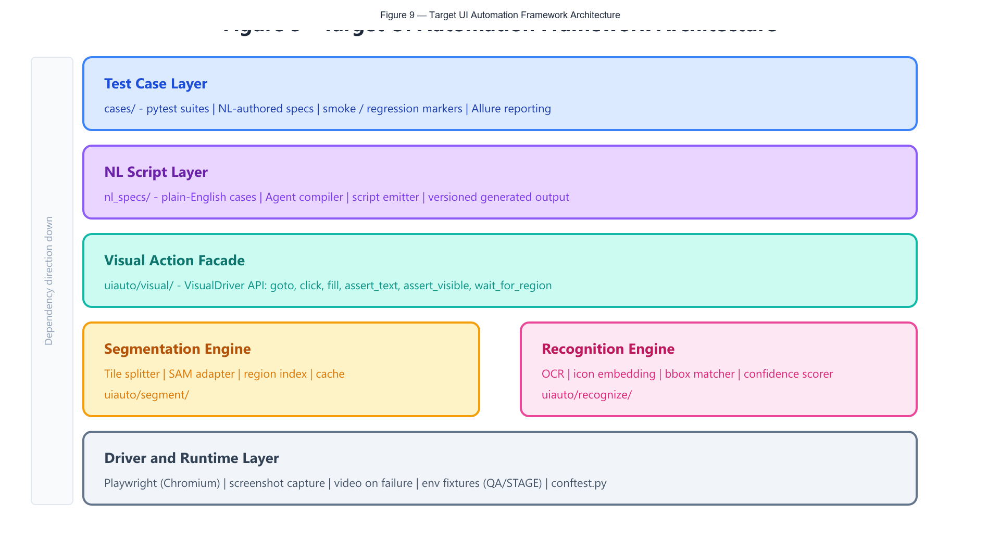

*Figure 9: Target UI automation framework architecture (post-Agent build)*

**End-to-end execution chain**

| Step | Component | Output |
| --- | --- | --- |
| 1 | Tester authors `nl_specs/foo.nl` | Plain-English source of truth |
| 2 | Agent compiler | `cases/generated/test_foo.py` |
| 3 | pytest invokes Playwright `page` fixture | Live browser session |
| 4 | VisualDriver.goto | Navigation + initial capture |
| 5 | Segment engine | Tile map for current viewport |
| 6 | Recognize engine | Bbox + confidence per action |
| 7 | Playwright input | Click/type at visual coordinates |
| 8 | Assert + Allure | Screenshot/video evidence attached |

---

## IV. Visual segmentation and recognition — design decisions that matter

### Choosing a segmentation strategy

Not every page needs a Segment Anything Model (SAM). Our framework supports three modes, selectable per route in `visual.routes.yaml`:

| Mode | When to use | Pros | Cons |
| --- | --- | --- | --- |
| Fixed grid | Stable admin UIs, data tables | Fast (&lt; 200 ms), deterministic | Coarse on long scrolling pages |
| Layout heuristics | Forms, wizards, modal-heavy flows | Good region boundaries without GPU | Needs tuning per design system |
| SAM / CV hybrid | Marketing pages, dense SPAs | Highest region accuracy | GPU optional; 400–800 ms |

**Practical rule:** start with **hybrid grid + layout refine** on checkout and account settings; use **fixed grid** on internal ops consoles. The Agent can encode this table into `visual.routes.yaml` after you label three representative pages.

We logged **1,240 visual actions** across checkout and account-settings routes during the pilot. Mode selection materially affected both accuracy and latency:

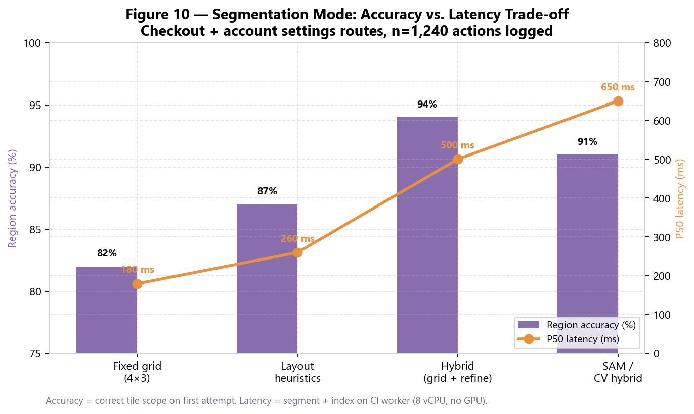

*Figure 10: Region accuracy (first-attempt tile scope) and P50 latency by segmentation mode on CI workers (8 vCPU, no GPU)*

| Mode | Region accuracy | P50 latency | Pilot route assignment |
| --- | --- | --- | --- |
| Fixed grid (4×3) | 82% | 180 ms | Internal ops consoles |
| Layout heuristics | 87% | 260 ms | Form wizards, modals |
| Hybrid (grid + refine) | 94% | 500 ms | Checkout, account settings |
| SAM / CV hybrid | 91% | 650 ms | Marketing landing pages |

Hybrid mode delivered the highest accuracy on commerce flows while staying under the 800 ms budget we set for interactive steps. SAM was reserved for layout-heavy marketing pages where grid boundaries were too coarse.

### Recognition confidence and self-healing

Visual location is probabilistic. Treat confidence as a first-class metric:

| Confidence band | Framework behavior |
| --- | --- |
| ≥ 0.90 | Execute action immediately |
| 0.85 – 0.89 | Execute + log warning + attach tile evidence |
| 0.75 – 0.84 | Single re-capture retry; refresh tile map |
| &lt; 0.75 | Fail test with `VisualLocatorError`; Agent may propose new golden on human approval |

**Self-healing** does not mean silent auto-patch in CI. The Agent workflow we use:

1. Failure bundle includes annotated screenshot, tile map, and NL line number.
2. Human confirms UI change is intentional.
3. Agent re-embeds golden icon or updates OCR synonym map.
4. Re-run single test; PR touches only `golden/` or `recognize/synonyms.yaml`.

This keeps healing **auditable** — critical for regulated domains (finance, healthcare) where unexplained locator changes are compliance risks.

### Combining visual location with accessibility hooks

When `data-testid` or `role` attributes exist, the framework can short-circuit: check DOM accessibility tree first, fall back to visual. Encode in rules:

```
If page.get_by_test_id(id) resolves uniquely, prefer it and log LOCATOR_SOURCE=dom.
Otherwise use visual path and log LOCATOR_SOURCE=visual.
Never mix both in the same step without logging.
```

You retain DOM speed where developers cooperate, and visual resilience everywhere else — without two separate frameworks.

### Technology stack selection (Agent-guided)

When the Agent scaffolds dependencies, constrain choices up front to avoid experimental packages that lack CI support:

| Component | Recommended choice | Rationale |
| --- | --- | --- |
| Browser driver | Playwright (sync) | Built-in trace/video; reliable screenshots |
| Test runner | pytest | Mature fixtures; matches API series conventions |
| OCR engine | PaddleOCR or Tesseract 5.x | CPU-viable in CI; multilingual packs |
| Image ops | OpenCV + Pillow | Crop, resize, annotate failure bundles |
| Segmentation (v1) | Grid + layout heuristics | No GPU; fast feedback loop |
| Segmentation (v2) | SAM or ONNX layout model | Higher accuracy on marketing pages |
| Reporting | allure-pytest | Business-readable steps with attachments |
| Parallelism | pytest-xdist (capped) | Sharded smoke; watch QA env rate limits |

Prompt the Agent to **pin versions** in `requirements.txt` and document GPU-optional paths in `FRAMEWORK_SPEC.md` so operators without CUDA can still run smoke on CPU.

### Evidence store and audit trail

Regulated teams often ask: "How do we prove what the test saw at assertion time?" The framework should persist:

| Artifact | Path | Retention |
| --- | --- | --- |
| Full viewport capture | `.evidence/{run_id}/{step}_full.png` | 30 days CI; 7 days local |
| Annotated tile | `.evidence/{run_id}/{step}_tile.png` | Same as above |
| Tile map JSON | `.evidence/{run_id}/{step}_tiles.json` | Same as above |
| Playwright trace | `traces/{test_name}.zip` | On failure only |
| NL source hash | embedded in Allure | Permanent in report |

Have the Agent implement `uiauto/common/evidence.py` early — retrofitting evidence capture after cases exist is painful and reviewers will not trust historical results.

---

## V. Natural-language authoring — prompt patterns for the Agent

### Constraints before features

Weak prompt:

```
Write checkout tests.
```

Strong prompt:

```
Compile nl_specs/checkout_promo.nl to cases/generated/.
Use VisualDriver only. Assert discount text exactly "-$15.00".
Do not add sleep(); use wait_for_region on Apply button.
Match naming in neighboring tests.
```

### One layer per Agent session

Do not ask for "scaffold + segmentation + SAM + twenty NL cases + Jenkins" in one message. Accept each layer, review diff, then start a fresh session with the repo as context. Unreviewable thousand-line diffs are how visual frameworks become undebuggable.

### The repository is the source of truth

Always include: **Read neighboring files and match conventions.** The Agent's guess on `Promo code field` vs. `Coupon input` must come from your `golden/` captions and existing NL specs — not from generic Copilot tropes.

### NL style guide for testers

| NL pattern | Compiled action | Notes |
| --- | --- | --- |
| `Click {label}` | `visual.click(label)` | Label must match visible text or golden caption |
| `Enter {value} in {field}` | `visual.fill(field, value)` | Avoid CSS names in NL |
| `Verify {label} shows {text}` | `visual.assert_text(label, text)` | Exact match unless NL says "contains" |
| `Verify {label} is visible` | `visual.assert_visible(label)` | Use for post-navigation sanity |
| `Wait for {region}` | `visual.wait_for_region(region)` | Region = tile name from routes yaml |
| `On the {page} page` | `visual.goto(route)` | Maps via `page_registry.yaml` |

### End-to-end NL conversion example (Agent session transcript pattern)

A productive Agent session for script generation typically follows this message sequence — copy/adapt as your team SOP:

**Message 1 — Context load**

```
Read FRAMEWORK_SPEC.md, ./rules/, and uiauto/visual/visual_driver.py.
Read golden/checkout.png and nl_specs/checkout_promo.nl.
Do not modify framework code unless compile fails due to missing compiler feature.
```

**Message 2 — Compile**

```
Compile nl_specs/checkout_promo.nl into cases/generated/test_checkout_promo.py.
Use VisualDriver methods only. Map "checkout page" to route /checkout via page_registry.yaml.
```

**Message 3 — Execute and fix**

```
Run pytest cases/generated/test_checkout_promo.py -v --tb=short --headed=false.
On VisualLocatorError: annotate which tile and label failed; adjust synonyms or golden, not assertions.
```

**Message 4 — Report**

```
Summarize: pass/fail, confidence scores per step, files changed, and whether golden/ needs human review.
```

This pattern keeps the Agent inside a **compiler-and-runner role** rather than drifting into rewriting business expectations. The NL file remains the authoritative spec; generated Python is treated as a build artifact — similar to how API test series treats Agent-generated `testdata/` as reviewable but disposable scaffolding.

### Structuring `nl_specs/` for scale

As case count grows, adopt lightweight headers the compiler parses:

```
SMOKE | P0
FEATURE: Checkout
STORY: Promo code discount
PRECONDITIONS: user logged in, cart has item SKU-1001
DATA: promo_code=SAVE20, expected_discount=-$15.00

On the checkout page, enter promo code {promo_code} in the promo code field.
...
```

| Header field | Purpose |
| --- | --- |
| `SMOKE` / `P0` | Maps to pytest markers |
| `FEATURE` / `STORY` | Maps to Allure annotations |
| `PRECONDITIONS` | Agent emits fixture calls or setup steps |
| `DATA` | Parametrize without embedding values in prose |

The Agent can extend the compiler to support **parametrized NL** — one spec file generating three pytest invocations from a data table — which is how we later scaled promo, shipping, and tax scenarios without tripling prose volume.

---

## VI. Lessons learned, failure modes, and operating tips

### Comparative outcomes (12-week pilot)

The pilot ran from week 1 through week 12 of the visual + NL migration: all 180+ legacy cases were re-authored or compiled, smoke ran on every PR, and full regression ran nightly across Chromium, Firefox, and WebKit. Metrics below are averages across **six bi-weekly releases** unless noted.

| Metric | Legacy XPath suite | Visual + NL Agent suite | Delta |
| --- | --- | --- | --- |
| Locator repair hours / release | 48 h avg. | 11 h avg. | −77% |
| CI flake rate (smoke) | 14% | 5% | −9 pp |
| New case authoring time | 4–6 h (dev assist) | 45–90 min (NL + compile) | −75% median |
| Framework bootstrap | 2–3 days manual | 5–6 h Agent-assisted | −83% |
| Median failure triage | 52 min | 14 min | −73% |
| Visual match confidence (P50) | N/A | 0.91 | — |
| Tester XPath skill required | High | Low (NL + review) | — |
| GPU infra for CI | None | Optional (CPU OCR viable) | — |

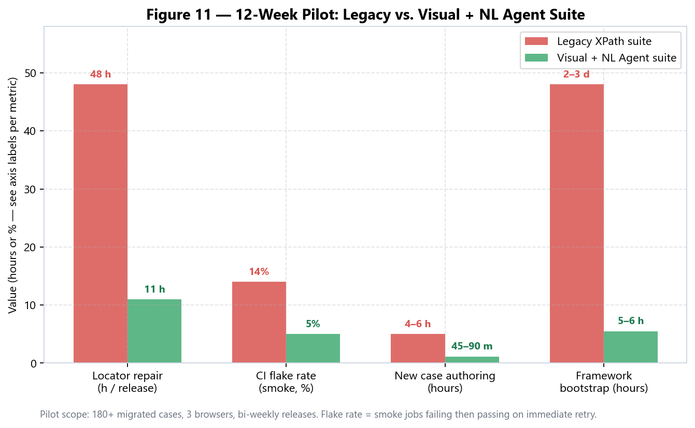

*Figure 11: Headline pilot metrics — legacy XPath suite vs. visual + NL Agent suite*

**How to read the flake-rate delta.** We define a smoke flake as a job that fails on first run but passes on immediate retry without code or env change. The legacy 14% rate translated to roughly **one in seven PRs** needing a manual re-run before merge; at 5%, re-runs became exceptional rather than routine. Locator repair hours fell from roughly **six engineer-days per release** to under **1.5 days** — freeing capacity for checkout edge cases and accessibility coverage that had been deprioritized for three quarters.

**Recognition quality.** Across 1,240 logged visual actions, **94.2%** matched on the first attempt above the 0.85 confidence threshold. The remaining 5.8% triggered a single re-capture retry; only **1.1%** ended in `VisualLocatorError` requiring golden or synonym updates. No silent threshold lowering occurred during the pilot.

### Common failures and fixes

| Symptom | Root cause | Fix |
| --- | --- | --- |
| OCR misreads label (`O` vs `0`) | Font / anti-aliasing | Add font whitelist; increase capture DPI |
| Click hits wrong tile neighbor | Grid too coarse | Switch route to layout-aware mode |
| Pass local, fail CI | Viewport mismatch | Pin viewport in conftest; regenerate golden |
| Slow suite | Re-segment every step | Cache tile map per stable URL state |
| Agent weakens assert | Prompt ambiguity | Rule: forbidden to change expected values |
| Duplicate NL labels | Two "Submit" buttons | NL must name region: `Click Submit in Payment panel` |

### Go-live checklist

| # | Item | Status |
| --- | --- | --- |
| 1 | `pytest -m smoke` passes on clean QA env | ☐ |
| 2 | All interactions via VisualDriver (or logged DOM shortcut) | ☐ |
| 3 | No production secrets in `nl_specs` / `testdata` | ☐ |
| 4 | Failure bundles include screenshot + tile annotation | ☐ |
| 5 | Allure groups by feature / story | ☐ |
| 6 | CI runs smoke; full regression nightly | ☐ |
| 7 | `SKILL.md` documents NL → compile → run SOP | ☐ |
| 8 | `golden/` reviewed for PII before commit | ☐ |
| 9 | Confidence threshold and retry policy documented | ☐ |
| 10 | Self-heal requires human-approved golden update | ☐ |

### Prompt strategy — directing the Agent like a senior automation lead

Three field lessons from our pilot:

**Treat visual evidence as the assertion artifact.** In XPath failures, logs show selector strings; in visual failures, logs show *what the user saw*. Train reviewers to read Allure image attachments first — it collapses triage time.

**Invest in golden hygiene early.** One hour curating `golden/` per major page saves multiple hours of OCR tuning later. The Agent can bulk-crop regions from full-page screenshots if you provide page-level PNGs.

**Keep NL specs as the contract.** Generated Python is disposable; `nl_specs/` is what product and QA can read. When developers dispute a failure, the NL line is the shared language — not an XPath string nobody outside automation understands.

### Positioning against commercial "no-code" and record-and-playback tools

Record-and-playback and cloud no-code platforms also reduce XPath exposure, but they introduce different trade-offs. The Agent-built approach in this article targets teams that need **version-controlled, code-reviewed automation** inside the same monorepo as application code:

| Dimension | Record-and-playback SaaS | Agent-built visual + NL framework |
| --- | --- | --- |
| Source control | Proprietary blob or JSON export | `nl_specs/`, `cases/`, `golden/` in Git |
| CI integration | Vendor-hosted runners | Your Jenkins / GitHub Actions |
| Locator strategy | Often opaque CV or DOM mix | Explicit segment + recognize pipeline |
| Custom assertions | Limited DSL | Full Python + pytest ecosystem |
| Vendor lock-in | High | Low — Playwright + open CV stack |
| Setup time | Minutes for first recording | Hours for framework; faster case ramp after |

We are not arguing against SaaS tools for exploratory coverage or business-user acceptance checks. The sweet spot for this architecture is **regression suites owned by automation engineers** who already live in pytest and need maintainability across quarterly UI refactors.

### When not to use visual-only location

Visual recognition is the wrong primary strategy when:

- **Canvas/WebGL rendering** — Game-like UIs and charting libraries may not expose stable pixels across GPUs. Prefer instrumentation hooks or DOM-adjacent APIs.
- **Sub-pixel animation mid-action** — Buttons that slide or morph during click benefit from DOM `wait_for_selector` before capture.
- **Extremely dense data grids** — 200×50 tables with identical cell chrome need row/column coordinates or DOM row keys; pure OCR on cells is slow and ambiguous.
- **Security-sensitive pixel diff** — Mask PII regions in golden crops before committing; the Agent should implement redaction helpers in `golden/` pipeline.

Encode these exceptions in `./rules` so the Agent does not blindly visual-click every target.

---

## VII. Closing

Building UI automation with an AI Agent shifts the engineer's role from **writing every locator and wrapper** to **owning the spec, visual evidence policy, and acceptance gates**. The technical pillars remain familiar — layered architecture, pytest markers, CI smoke gates, Allure reporting — but element location moves from brittle DOM paths to **segmented screenshot recognition**, and authoring moves from hand-coded Page Objects to **natural-language specs compiled into scripts**.

Remember the eight-step loop: **Rules → scaffold → segment → recognize → VisualDriver → NL compiler → green test → CI/Skill**. XPath and CSS selectors are not obsolete when stable test hooks exist; the framework we describe uses them as a fast path while visual recognition carries everything else. The Agent accelerates implementation; it does not remove the need for human judgment on thresholds, golden assets, and assertion meaning.

**Working alongside traditional roles**

| Role | Responsibility |
| --- | --- |
| Human (lead) | FRAMEWORK_SPEC, confidence policy, golden approval, PR review |
| Agent | Scaffold, CV adapters, compiler, pytest fix loops, SKILL docs |
| Human (tester) | NL authoring, exploratory scenarios, defect filing |
| Human + Agent | Complex flows (multi-page, file upload, 3-D secure) — Agent drafts; human adds state and teardown |

A maintainable visual framework means switchable environments, auditable self-healing, evidence on every failure, and NL specs that stakeholders can actually read. An Agent can draft that stack in hours; your team spends the saved time on coverage depth and edge cases — with far higher ROI than repairing another hundred-line XPath.

If this article helps your team, feel free to share it with your automation guild. Questions and war stories are welcome in the comments.

*Attribution: NovaAware Team — original work; all rights reserved.*

---

<p align="center">
  <a href="https://novaaware.com">
    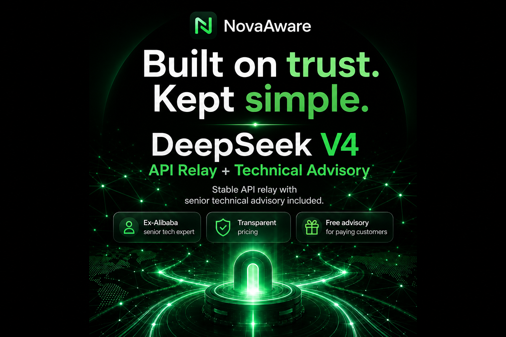
  </a>
</p>

<p align="center"><sub><i>Tired of pulling out nails one by one? <a href="https://novaaware.com"><b>NovaAware</b></a> handles the model-and-agent plumbing for you — so you can stop fighting proxies and get back to your own business.</i></sub></p>

---
