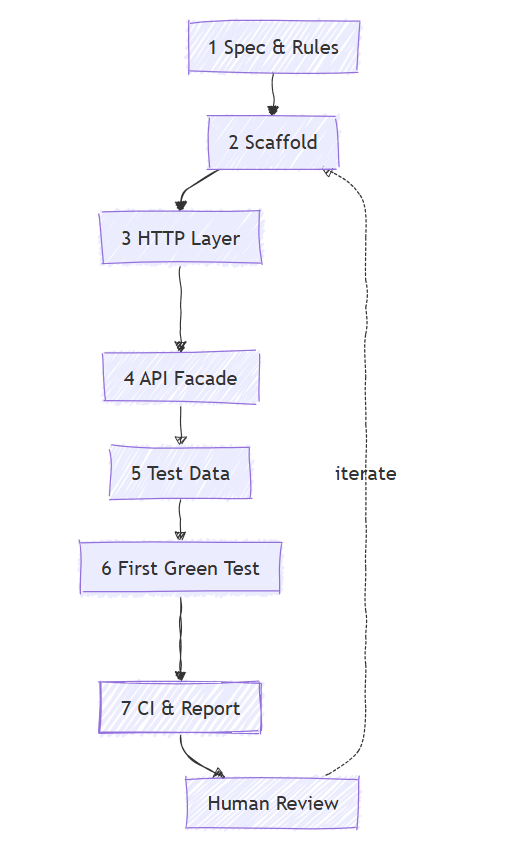
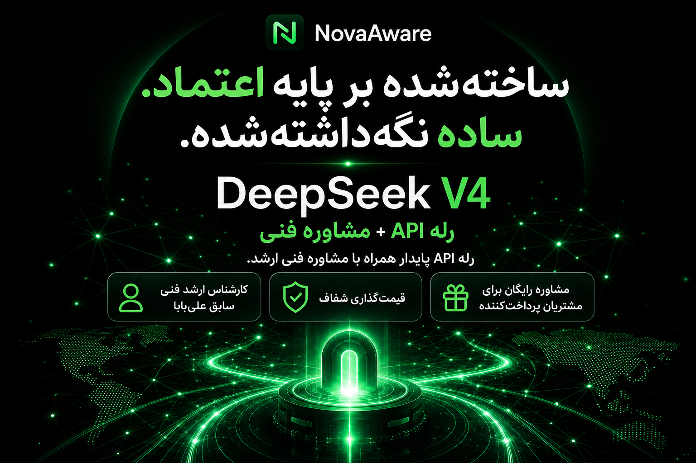
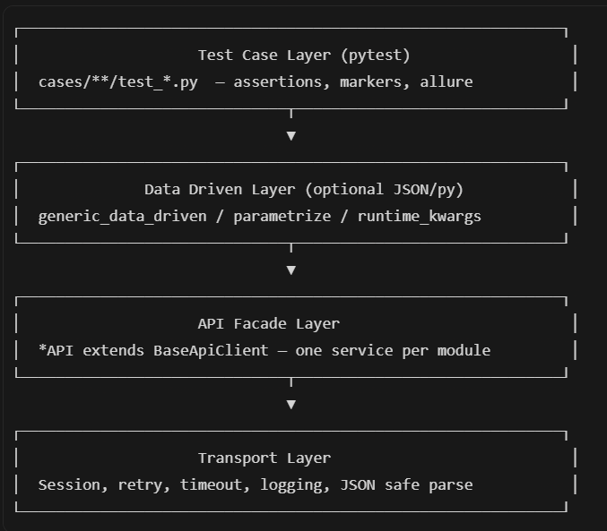
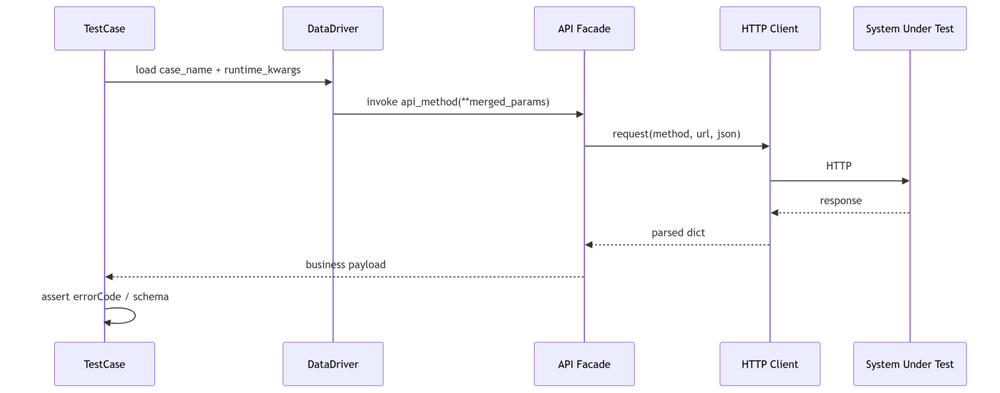

<div dir="rtl">

> تاریخ انتشار اصلی: ژوئن ۲۰۲۶

# سری AI-Testing (بخش اول) — چگونه با هوش مصنوعی به‌سرعت اتوماسیون تست API بسازیم

## ۱. پیش‌زمینه

اوایل امسال، تیم ما یک ابتکار بین‌حوزه‌ای را که چندین سیستم را در بر می‌گرفت بر عهده گرفت. بخش میان‌پلتفرم (middle-platform) سهم ما بود: بیش از ۱۰۰ API، دو محیط، و نتایج تست که باید ظرف یک هفته تحویل می‌شد. روش قدیمی به این معنا بود که تنها برای داربست‌بندی پوشه‌ها، نوشتن BaseClient، سیم‌کشی pytest و Allure، و سپس هم‌ترازسازی دستی موارد تست با داده‌ها، نیم‌روز زمان می‌برد. این بار ما ایجنت هوش مصنوعی را مانند یک معمار تست در برنامه‌نویسی دونفره (pair-programming) به کار گرفتیم: از اسکلت مخزن تا اولین تست سبز حدود دو ساعت طول کشید. این مقاله آن اجرا را به یک راهنمای عملی و قابل‌استفاده‌ی مجدد تبدیل می‌کند که می‌توانید در تیم خود به کار بگیرید.

**تحلیل عمیق — چرا «داربست‌بندی دستی» دیگر همگام نمی‌ماند**

مسیر سنتی آشناست: خواندن مستندات API ← تعریف لایه‌ها ← نوشتن پوشش‌دهنده‌های (wrapper) HTTP ← افزودن کمک‌کننده‌های assertion ← وصله‌کردن conftest ← کپی‌کردن موارد تست یکی‌یکی. گلوگاه سرعت تایپ نیست، بلکه جابه‌جایی بافت (context switching) است — باید همزمان نام متغیرهای محیطی، کدهای خطای کسب‌وکار، الگوهای احراز هویت و زنجیره‌های وابستگی داده را در ذهن نگه دارید. یک لایه را از قلم بیندازید و همه‌چیز در ادامه‌ی مسیر دوباره‌کاری می‌شود.

مدل ایجنت هوش مصنوعی متفاوت است: انسان‌ها قیدها و معیارهای پذیرش را تعیین می‌کنند؛ ایجنت یک حلقه‌ی بسته را در مخزن اجرا می‌کند — خواندن کد ← ویرایش فایل‌ها ← اجرای دستورات ← خواندن خطاها ← اصلاح دوباره. شما دیگر «کسی که هر خط از کد فریم‌ورک را می‌نویسد» نیستید؛ شما مالک محصولِ فریم‌ورک هستید.

| بُعد | ساخت سنتی | ساخت با ایجنت هوش مصنوعی |
| --- | --- | --- |
| داربست (Scaffold) | کپی از مخزن قدیمی / ویکی | ایجنت از روی AGENTS.md + قراردادها تولید می‌کند |
| کلاینت API | دستی برای هر endpoint | ایجنت OpenAPI / نمونه‌ی curl را می‌خواند و کلاس‌های ‎*API‎ را تولید می‌کند |
| داده‌ی تست | صفحه‌گسترده ← چسباندن دستی | ایجنت داده را در ‎testdata/*.py‎ یا JSON استخراج می‌کند |
| حلقه‌ی اشکال‌زدایی | شما pytest را به‌صورت محلی اجرا می‌کنید | ایجنت pytest را اجرا می‌کند، traceback را تجزیه می‌کند و وصله می‌زند |
| دانش | دانش قبیله‌ای در چت | قواعد + مهارت‌ها (skills) که در ‎./rules‎ ماندگار می‌شوند |

## ۲. ساخت فریم‌ورک اتوماسیون با یک ایجنت هوش مصنوعی

### ۱. سه «ورودی سخت» پیش از شروع کار ایجنت

ایجنت جادو نیست. بدون ورودی، base_url را از خود می‌سازد. پیش از شروع، این سه مورد را در یک فایل FRAMEWORK_SPEC.md آماده کنید:

- قرارداد پشته‌ی فناوری (tech stack): پایتون ‎3.10+‎، pytest، requests، allure-pytest؛ سبک داده‌محور (JSON / دیکشنری پایتون).
- قرارداد لایه‌بندی: برای مثال ‎apiauto/api‎ (لایه‌ی پروتکل)، ‎apiauto/common‎ (کلاینت و موتور داده‌محور)، ‎cases/‎ (موارد تست کسب‌وکار)، ‎testdata/‎ (داده‌های ثابت).
- یک مورد تستِ مسیر طلایی (golden-path): ساده‌ترین و مستندترین API را انتخاب کنید (مثلاً یک درخواست GET)، یک نمونه‌ی درخواست واقعی و errorCode مورد انتظار را پیوست کنید.

با وجود یک مشخصات (spec)، اولین prompt ایجنت می‌تواند مشخص و دقیق باشد — نه جملات مبهمی مانند «برایم یک فریم‌ورک اتوماسیون بساز».

### ۲. ساخت فریم‌ورک — حلقه‌ی بسته‌ی هفت‌مرحله‌ای



مراحل زیر وظایفی هستند که ایجنت اجرا می‌کند، نه کار تایپ‌کردنی که خودتان انجام می‌دهید.

**مرحله ۱: تثبیت قواعد غیرقابل‌مذاکره**

قواعد سطح پروژه را زیر ‎./rules‎ قرار دهید، برای مثال:

```
# All HTTP traffic must go through BaseApiClient; raw requests.get (or other direct requests calls) are not allowed in test cases.
# Assert business response codes first (errorCode / code), then HTTP status (e.g. 200).
# Sensitive tokens may appear only in testdata; never commit real production secrets.
```

سپس به ایجنت بگویید:

```
Read existing apiauto/common/base_client.py if any; otherwise create BaseApiClient with Session reuse, retry on 5xx, and safe JSON parse. Match typing style in repo.
```

ایجنت مخزن را پویش می‌کند و سبک موجود را تطبیق می‌دهد، به‌جای اینکه یک قالب عمومی را تحویل دهد. معیار پذیرش این مرحله: دستور ‎python -c "from apiauto.common.base_client import BaseApiClient"‎ بدون خطا import شود.

**مرحله ۲: اجازه دهید ایجنت اسکلت دایرکتوری را تولید کند (نه کپی از یک پروژه‌ی قدیمی)**

تیم‌ها اغلب یک درخت کامل ‎cases/‎ را از خط کسب‌وکار دیگری clone می‌کنند و کد مرده را به ارث می‌برند. رویکرد ایجنت باید یک درخت کمینه‌ی قابل‌اجرا را درخواست کند:

```
project-root/
├── apiauto/
│   ├── api/           # *API classes
│   ├── common/        # client, data driven, templates
│   └── case/          # smoke tests
├── cases/             # domain test suites
├── testdata/          # static payloads
├── conftest.py        # fixtures, env, markers
├── pytest.ini
└── requirements.txt
```

نمونه‌ی prompt (دستورهای انگلیسی معمولاً برای ایجنت‌ها پایدارترند):

```
Create minimal pytest layout per FRAMEWORK_SPEC.md.
Add pytest.ini with markers: smoke, regression, P0.
Add conftest.py: env switch QA/STAGE via ENV variable.
Do not create empty placeholder packages without __init__.py.
```

پس از تولید، تنها یک کار می‌کنید: diff را بازبینی کنید و پوشه‌های اضافی را حذف کنید — این هنوز هم سریع‌تر از ‎mkdir‎ از صفر است.

**مرحله ۳: لایه‌ی پروتکل — از curl / Swagger تا نمای API (API Facade)**

مستندات API یا یک curl واقعی را به ایجنت بدهید و خروجی را مقید کنید:

```
Generate GrabBookAPI extends BaseApiClient:
- method grab_book(**kwargs) -> dict
- base_url from os.environ["TRADE_HOST"]
- docstring lists required business fields
```

خروجی معمول ایجنت با یک الگوی پوشش‌دهنده‌ی نازک (thin-wrapper) مطابقت دارد: فقط مونتاژ URL و body؛ assertionها در لایه‌ی case باقی می‌مانند.

نقاط بازبینی دستی (الزامی):

| مورد بررسی | معیار قبولی |
| --- | --- |
| الحاق URL | مسیر نسبی با base_url کار کند |
| همان‌توانی (Idempotency) | بدنه‌ی POST در طول تلاش‌های مجدد تغییر نکند |
| هدر احراز هویت | توکن از fixture خوانده شود، نه به‌صورت hardcode در کلاس API |

---

<p align="center">
  <a href="https://novaaware.com">
    
  </a>
</p>

<p align="center"><sub><i>خسته از بیرون کشیدن میخ‌ها یکی‌یکی؟ <a href="https://novaaware.com"><b>NovaAware</b></a> کارهای زیرساختی مدل و ایجنت را برایتان انجام می‌دهد تا دیگر با پراکسی‌ها دست‌وپنجه نرم نکنید و به کسب‌وکار خودتان برگردید.</i></sub></p>

---

**مرحله ۴: لایه‌ی داده‌محور — ایجنت testdata را به‌صورت دسته‌ای می‌سازد**

تقریباً ۶۰٪ زمان اتوماسیون API صرف نگهداری داده می‌شود. نمونه‌های Swagger یا JSON ضبط‌شده را به ایجنت بدهید:

```
For endpoint getRefundMerchant:
1. Create testdata/getRefundMerchant_data.py with one happy-path dict.
2. Add parametrize wrapper in cases/refund_core/test_getRefundMerchant.py
3. Use pytest.mark.smoke on happy path only.
```

ایجنت می‌تواند یک دیکشنری پایتون (برای فیلدهای کم) یا JSON + generic_data_driven (برای موارد نام‌دار متعدد) تولید کند. پروژه‌ی شما ممکن است پیش‌تر از چیدمانی مشابه پیروی کند:

```python
# testdata shape (example)
getMerchant = {
    "mid": "...",
    "orderSerialNo": "210089202501011320266400",
    # ...
}
```

نکته: از ایجنت بخواهید مقادیری مانند traceId، ts و غیره را به مقادیر پویای ‎@pytest.fixture‎ منتقل کند تا از شکست‌های ناپایدار (flaky) ناشی از «پارامتر منقضی‌شده» جلوگیری شود — این را در قواعد (Rules) ثابت کنید.

**مرحله ۵: اولین تست سبز — ایجنت حلقه‌ی اشکال‌زدایی خود را به همراه دارد**

این مرحله بیشترین تفاوت را با راه‌اندازی سنتی دارد. به ایجنت بگویید:

```
Run: pytest cases/refund_core/test_getRefundMerchant.py -v --tb=short
Fix failures until green. Do not weaken assertions.
```

ایجنت بر اساس tracebackها، hostها، نام فیلدها و هدرها را تنظیم می‌کند تا تست سبز شود. انسان معمولاً تنها در سه حالت دخالت می‌کند:

- (۱) VPN / لیست سفید — ایجنت نمی‌تواند به محیط دسترسی پیدا کند؛ شما دسترسی شبکه را تأیید می‌کنید.
- (۲) شناسه‌های واقعی کسب‌وکار — مثلاً شماره سفارش از پلتفرم داده‌ی تست؛ شما spec را به‌روزرسانی می‌کنید.
- (۳) نقص‌های خود محصول — باگ را ثبت کنید؛ فعلاً آن را xfail علامت بزنید.

برای Allure، این را اضافه کنید:

```
Add @allure.feature / @allure.story decorators consistent with service name.
Ensure pytest --alluredir=./allure-results works in CI.
```

**مرحله ۶: CI و دروازه‌های کیفیت — ایجنت پایپ‌لاین را پیش‌نویس می‌کند، انسان دسترسی‌ها را تأیید می‌کند**

از ایجنت بخواهید بر اساس CI موجود (GitHub Actions / Jenkinsfile) یک پایپ‌لاین کمینه پیش‌نویس کند:

```yaml
# Conceptual CI pipeline — review secrets after Agent output
stages:
  - lint (ruff/flake8)
  - test (pytest -m smoke)
  - report (allure upload)
```

آنچه انسان باید بازبینی کند:

| محصول کار (Artifact) | ایجنت می‌تواند پیش‌نویس کند | انسان باید تأیید کند |
| --- | --- | --- |
| requirements.txt | بله | نسخه‌ها را برای محیط شبه‌تولید pin کنید |
| اسرار / توکن‌ها | هرگز commit نکنید | از مخزن اسرار CI استفاده کنید |
| کارگرهای موازی | پیشنهاد ‎pytest -n auto‎ | نرخ را در برابر محیط QA مشترک محدود کنید |
| تلاش مجدد در شکست | افزودن افزونه‌ی retry برای موارد flaky | تعداد تلاش‌ها را محدود کنید تا باگ‌ها پنهان نشوند |

**مرحله ۷: تثبیت مهارت‌ها (Skills) — تبدیل موفقیت‌ها به دستورهای قابل‌استفاده‌ی مجدد**

پس از پابرجا شدن فریم‌ورک، فرایند «افزودن یک مورد تست API» را به‌صورت یک Skill (یا SKILL.md تیمی) مستند کنید، برای مثال:

```
Provide API path + method + sample response
Generate *API + testdata + test_*.py
Open a PR only after the single-file pytest run passes locally.
```

اعضای جدید تیم می‌توانند به‌جای آموزش دوباره‌ی لایه‌بندی به ایجنت، از ‎@skill api-case-scaffold‎ استفاده کنند.

### ۳. فریم‌ورک هدفِ تولیدشده توسط هوش مصنوعی چه شکلی است

لایه‌بندی پس از ایجنت با یک فریم‌ورک داده‌محور بالغ مطابقت دارد؛ فقط سرعت تولید یک مرتبه‌ی بزرگی بیشتر است.



**زنجیره‌ی فراخوانی داده‌محور**



## ۳. درس‌ها و نکات

### ۱. راهبرد Prompt — هدایت ایجنت مانند یک Team Lead باتجربه

سه درس عملی:

**قیدها مقدم بر قابلیت‌ها**

Prompt بد: «تست‌های API بازپرداخت را بنویس.»

Prompt خوب: «زیر ‎cases/refund_core/‎ تست اضافه کن؛ هیچ requests خامِ جدیدی نباشد؛ ‎assert errorCode=="0000"‎؛ داده در ‎testdata/‎.»

**هر بار فقط یک لایه را گسترش بده**

درخواست نکنید که «داربست + ۲۰ مورد تست + Jenkins» در یک پیام انجام شود. هر لایه را بپذیرید، سپس یک جلسه‌ی ایجنت تازه آغاز کنید — وگرنه diff آن‌قدر بزرگ می‌شود که قابل‌بازبینی نیست.

**مخزن، منبع حقیقت است**

همیشه این را اضافه کنید: ‎Read neighboring files and match naming conventions.‎ (فایل‌های همسایه را بخوان و قراردادهای نام‌گذاری را تطبیق بده.)

حدس ایجنت درباره‌ی اینکه تیم شما از ‎order_No‎ استفاده می‌کند یا ‎orderNo‎، از هر آموزش عمومی دقیق‌تر است.

### ۲. شکست‌های رایج و راه‌حل‌ها

| نشانه | علت ریشه‌ای | راه‌حل |
| --- | --- | --- |
| به‌صورت محلی همه سبز، اما در محیط production (prod) همچنان خراب | فقط ‎assert‎ روی HTTP 200 | قاعده: باید همه‌ی کدهای کسب‌وکار assert شوند |
| برچسب‌های زمانی hardcode در داده | ایجنت نمونه را کپی کرده | fixtureهای پویا در conftest |
| کلاس‌های API متورم | assertionها داخل API | الزام: API فقط فراخوانی کند؛ assert در caseها |
| اختراع دوباره‌ی ابزارها | ایجنت ابتدا جست‌وجو نکرده | اولین خط prompt: ‎Search repo before create‎ |
| اسرار در Git | نبود hook پیش از commit | detect-secrets + بازبینی دستی در PR |

### ۳. فهرست بررسی پیش از استقرار

پیش از تحویل با این جدول خودآزمایی کنید — تا از وضعیت «دمو اجرا می‌شود اما قابل‌نگهداری نیست» پرهیز شود:

<table>
  <thead>
    <tr>
      <th>#</th>
      <th>مورد</th>
      <th align="center">وضعیت</th>
    </tr>
  </thead>
  <tbody>
    <tr>
      <td>۱</td>
      <td>‎pytest -m smoke‎ در یک محیط تمیز پاس می‌شود</td>
      <td align="center" valign="middle">☐</td>
    </tr>
    <tr>
      <td>۲</td>
      <td>بدون requests خام؛ همه‌چیز از طریق BaseApiClient</td>
      <td align="center" valign="middle">☐</td>
    </tr>
    <tr>
      <td>۳</td>
      <td>بدون اسرار تولید در testdata</td>
      <td align="center" valign="middle">☐</td>
    </tr>
    <tr>
      <td>۴</td>
      <td>لاگ‌های شکست، requestId/traceId را نمایان می‌کنند</td>
      <td align="center" valign="middle">☐</td>
    </tr>
    <tr>
      <td>۵</td>
      <td>Allure بر اساس feature گروه‌بندی می‌شود</td>
      <td align="center" valign="middle">☐</td>
    </tr>
    <tr>
      <td>۶</td>
      <td>CI فقط smoke را اجرا می‌کند؛ مجموعه‌ی کامل به‌صورت nightly</td>
      <td align="center" valign="middle">☐</td>
    </tr>
    <tr>
      <td>۷</td>
      <td>‎./rules‎ یا SKILL، روال استاندارد (SOP) افزودن موارد تست API جدید را مستند کرده است.</td>
      <td align="center" valign="middle">☐</td>
    </tr>
  </tbody>
</table>

## ۴. سخن پایانی

ساخت اتوماسیون API با یک ایجنت هوش مصنوعی، در اصل تصمیم‌های معماری را از کار یدیِ پیاده‌سازی جدا می‌کند: شما spec و معیار پذیرش را می‌نویسید؛ ایجنت حلقه را در مخزن می‌بندد. هفت مرحله را به خاطر بسپارید — قواعد ← اسکلت ← Client ← API ← داده ← تست سبز ← CI/Skill. از نظر فنی هنوز هم باید بر لایه‌بندی، assertionهای کسب‌وکار و جداسازی داده پایبند بمانید — این‌که کد را ایجنت نوشته باشد، آن‌ها را به‌طور خودکار درست نمی‌کند.

**همکاری در کنار راه‌اندازی سنتی**

ایجنت جایگزین مهندسان تست نمی‌شود؛ بلکه کار مکانیکی را می‌بلعد. تقسیم کار پیشنهادی به این شرح است:

- انسان: spec، راهبرد محیط، سیاست assertion کسب‌وکار، بازبینی PR، طراحی سناریوهای اکتشافی
- ایجنت: داربست، قالب‌های Client/API، testdata انبوه، حلقه‌های اصلاح pytest، مستندات و SKILL
- انسان + ایجنت: جریان‌های پیچیده (سفارش ← پرداخت ← بازپرداخت) — ایجنت پیش‌نویس می‌کند؛ انسان ماشین حالت (state machine) و منطق پاک‌سازی (teardown) را اضافه می‌کند

در مجموع، «کامل» بودنِ یک فریم‌ورک یعنی: محیط‌های قابل‌تعویض، موارد داده‌محور، گزارش‌گیری، دروازه‌های CI و موارد قابل‌گسترش — ایجنت می‌تواند این‌ها را در حد چند ساعت پیش‌نویس کند؛ شما زمان باقی‌مانده را صرف سناریوهای مرزی می‌کنید، که ROIِ کلی بسیار بالاتری به همراه دارد.

اگر این مطلب برایتان مفید بود، خوشحال می‌شویم آن را بپسندید و ذخیره کنید. پرسش‌ها در بخش نظرات خوش‌آمدند.

نسبت‌دهی: تیم NovaAware — اثر اصلی؛ تمامی حقوق محفوظ است.

---

<p align="center">
  <a href="https://novaaware.com">
    
  </a>
</p>

<p align="center"><sub><i>خسته از بیرون کشیدن میخ‌ها یکی‌یکی؟ <a href="https://novaaware.com"><b>NovaAware</b></a> کارهای زیرساختی مدل و ایجنت را برایتان انجام می‌دهد تا دیگر با پراکسی‌ها دست‌وپنجه نرم نکنید و به کسب‌وکار خودتان برگردید.</i></sub></p>

---

</div>
