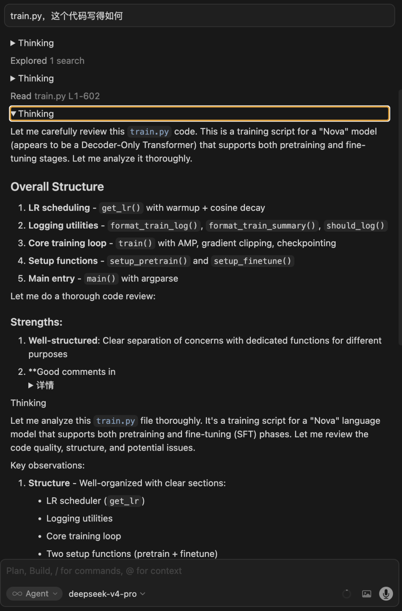
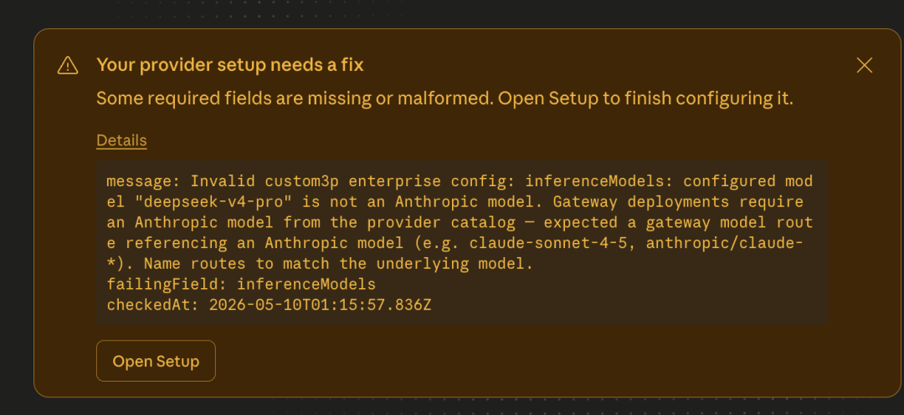
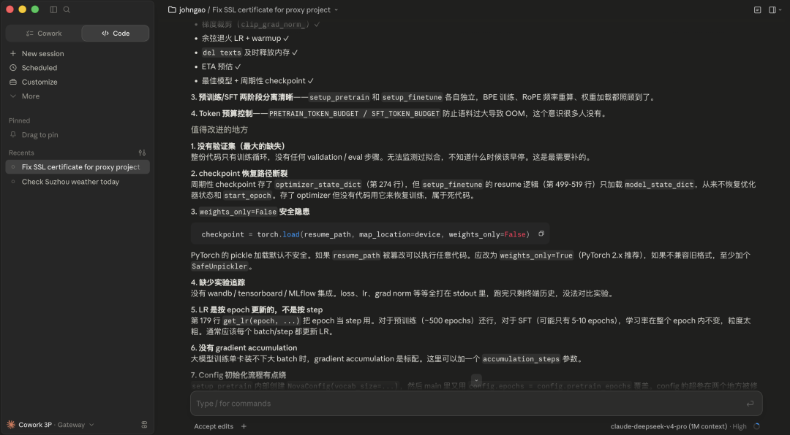

<div dir="rtl">

# درس‌هایی از یکپارچه‌سازی DeepSeek V4 با ایجنت‌های مختلف

> تاریخ انتشار اصلی: ۱۰ مه ۲۰۲۶

## ۰. مقدمه

در کار توسعه‌ی روزمره‌ام، بیشتر اوقات کدها را با ترکیب Cursor + Claude می‌نویسم. این ترکیب برایم کاملاً روان کار می‌کرد، اما مدتی پیش Claude مرتب دچار اختلال می‌شد؛ وضعیتش دائماً بالا و پایین می‌رفت، گاهی کند پاسخ می‌داد و گاهی درست وسط یک کار ناگهان از کار می‌افتاد. پس از چند بار تکرار این اتفاق، کاری که داشتم پیش می‌بردم مدام به اجبار قطع، بازگردانده و از نو شروع می‌شد، که تأثیر بسیار بزرگی بر بهره‌وری کلی داشت. چیزی که بیشتر آزارم می‌داد، در واقع تنها بی‌ثباتی خودِ محصول نبود، بلکه آن حس آزاردهنده‌ی همیشه گره‌خورده بودن به ریتم دیگران بود — حس «در دست بیگانگان اسیر بودن». ابزار مال دیگران است، مدل مال دیگران است، و اگر تصمیم بگیرند که اجازه‌ی استفاده ندهند، دیگر نمی‌توانی استفاده کنی.


*شکل ۱: نتایج بنچمارک مدل*

اتفاقاً در اواخر آوریل، DeepSeek نسخه‌ی V4 Pro را منتشر کرد. همان‌طور که در شکل ۱ نشان داده شده، از نظر امتیازهای بنچمارک، هم توانایی کدنویسی و هم توانایی ریاضی آن در رده‌ی نخست قرار دارند؛ و مهم‌تر از آن، قیمتش — تنها چند یوآن به ازای هر یک میلیون توکن، بیش از یک مرتبه‌ی بزرگی ارزان‌تر از Claude 4.7. با کنار هم قرار گرفتن این دو موضوع، تصمیم گرفتم بهره‌وری روزمره‌ام را از Claude به مدل DeepSeek V4 Pro منتقل کنم. اما وقتی واقعاً دست به کار شدم تا آن را به چند ایجنتی که هر روز استفاده می‌کنم وصل کنم، فهمیدم که به آن سادگی که تصور می‌کردم نیست — در این مسیر به موانع و دردسرهای زیادی برخوردم. هدف از نوشتن این مقاله این است که این تجربیات را به‌طور کامل گردآوری کنم تا برای توسعه‌دهندگانی که آن‌ها هم می‌خواهند به DeepSeek مهاجرت کنند، مقداری از زمان آزمون‌وخطا را صرفه‌جویی کنم تا بتوانند بر کسب‌وکار خود تمرکز کنند.

## ۱. دردسرهای یکپارچه‌سازی با Cursor

اگر فقط به مستندات رسمی Cursor نگاه کنید، یکپارچه‌سازی یک مدل جدید تقریباً به سادگی عوض کردن یک لامپ است: در تنظیمات، یک Base URL سازگار با OpenAI وارد کنید، یک API Key بچسبانید، و تمام. اما پس از اینکه واقعاً DeepSeek V4 Pro را وصل کردم، فهمیدم که این «سادگی» فقط در مستندات وجود دارد. در مسیر واقعی یکپارچه‌سازی، تقریباً در هر مرحله یک میخ کار گذاشته شده بود که باید آن‌ها را یکی‌یکی به‌آرامی بیرون می‌کشیدم.

### مانع اول: حالت تفکر (thinking mode) در مکالمات چندمرحله‌ای مستقیماً از کار می‌افتد.

پس از وارد کردن مستقیم `https://api.deepseek.com` در Cursor، دور اول و دوم به‌ظاهر عادی بودند. اما به‌محض اینکه مکالمه پیش می‌رفت و فراخوانی ابزارها (tool calls) وارد بافت (context) می‌شد، DeepSeek این خطا را پرتاب می‌کرد: *«The reasoning_content in the thinking mode must be passed back to the API.»*

ترجمه‌ی آن این است: پیام assistant در دور قبلی حاوی `reasoning_content` (فرایند تفکر) بوده، و در دور بعدی باید آن را عیناً برگردانی. حالت تفکر DeepSeek «تفکر» را به‌عنوان بخشی از وضعیت مکالمه به‌طور سخت‌گیرانه مدیریت می‌کند، و اگر در مکالمه‌ی چندمرحله‌ای آن غایب باشد، از ادامه دادن سر باز می‌زند. مشکل اینجاست که Cursor فیلد `reasoning_content` را دوباره پر نمی‌کند، بنابراین قرارداد دو طرف با هم همخوانی ندارد و مکالمه به‌طور غیرعادی قطع می‌شود.

بنابراین، تا پیش از آنکه Cursor این باگ سازگاری پروتکل را برطرف کند، ساختن یک پراکسی (proxy) به‌صورت محلی تقریباً تنها راه‌حل عملی است. ایده‌ی آن چندان پیچیده نیست: رویکرد من این بود که یک لایه پراکسی میان Cursor و DeepSeek اضافه کنم، `reasoning_content` را از پاسخ بالادست (upstream) استخراج و ذخیره (cache) کنم، و سپس در دور بعدی که Cursor درخواست خود را می‌فرستد، آن را بی‌سروصدا دوباره تزریق کنم. نه قرارداد سمت کلاینت نیاز به تغییر دارد و نه قرارداد بالادست نیاز به سازش؛ همه‌ی «وصله‌ها» در همین لایه‌ی میانی متمرکز می‌شوند. اما با وجود سادگی ایده، نوشتن واقعی آن با زنجیره‌ای از مسائل جزئی روبه‌رو شد که هرکدام باید جداگانه حل می‌شدند.

### مانع دوم: Cursor فقط HTTPS را می‌پذیرد.

پراکسی روی پورت محلی ۸۶۸۶ اجرا می‌شود. در ابتدا می‌خواستم مستقیماً `http://localhost:8686/v1` را برای استفاده‌ی Cursor تنظیم کنم، اما Cursor الزام می‌کند که Base URL سازگار با OpenAI حتماً HTTPS باشد — آدرسی که با `http://` شروع شود حتی ذخیره هم نمی‌شود. ساده‌ترین راه‌حل استفاده از یک تونل برای نمایان کردن پورت محلی به‌صورت یک آدرس عمومی HTTPS است؛ serveo / ngrok / cloudflared همگی کار می‌کنند. serveo نه به ثبت‌نام حساب نیاز دارد و نه به نصب کلاینت — تنها یک دستور ssh کافی است:

```bash
ssh -o StrictHostKeyChecking=no -tt -R 80:localhost:8686 serveo.net
```

پس از اجرا، آدرسی مانند `https://xxxxxxxx.serveousercontent.com` دریافت می‌کنید. کافی است `/v1` را به انتهای آن اضافه کرده و در Cursor وارد کنید.

### مانع سوم: هرگز روی پورت محلی HTTPS را فعال نکنید.

اولین واکنش شاید این باشد: «حالا که Cursor به HTTPS نیاز دارد، چرا SSL را روی Spring Boot محلی‌ام روشن نکنم و تمام؟» این کار را نکنید. من در ابتدا دقیقاً همین کار را کردم، و در نتیجه به‌محض اینکه Cursor درخواستی فرستاد، پراکسی بلافاصله این پیام را بیرون داد:

```
Bad Request: This combination of host and port requires TLS.
```

دلیلش این است که تونل‌هایی مانند serveo / ngrok به‌طور پیش‌فرض درخواست‌های خارجی را به‌صورت HTTP متن‌ساده (plaintext) به پورت محلی بازمی‌گردانند، و TLS لایه‌ی بیرونی پیش‌تر توسط گواهی سمت تونل مدیریت شده است. اگر Tomcat محلی هم به‌اجبار یک HTTPS Connector را فعال کند، مثل این است که یک سر متن‌ساده باشد و سر دیگر دست‌دادن (handshake) TLS بخواهد، که طبیعتاً رد می‌شود. روش درست این است که سمت محلی را خالص HTTP نگه دارید و TLS را کاملاً به تونل بسپارید.

### مانع چهارم: به‌نظر می‌رسد پراکسی درخواست را دریافت می‌کند، اما Cursor مدام در حال چرخیدن است.

این پنهان‌ترین دردسری بود که به آن برخوردم، و کاملاً ناشی از یک ضدالگوی (anti-pattern) Spring WebClient بود. منطقی که در ابتدا نوشتم تقریباً این‌گونه بود:

```java
ClientResponse upstream = webClient.post()
        ....
        .exchangeToMono(Mono::just)
        .block();   // دریافت پاسخ
upstream.bodyToFlux(...)...   // سپس مصرف بدنه (body)
```

به‌نظر منطقی می‌آید، اما Reactor این‌گونه عمل نمی‌کند. به‌محض اینکه `exchangeToMono` بازمی‌گردد، جریان بدنه‌ی متناظر زودهنگام توسط Reactor آزاد می‌شود، و وقتی بعداً از بیرون `bodyToFlux` را فراخوانی می‌کنی، همیشه یک Flux خالی دریافت می‌کنی. نشانه‌اش این است که با وجود اینکه بالادست به‌وضوح ۲۰۰ OK برمی‌گرداند، با ۰ قطعه (chunk) کامل می‌شود؛ Cursor یک پاسخ کاملاً خالی دریافت می‌کند، آن را به‌عنوان timeout تشخیص می‌دهد و بلافاصله دوباره تلاش می‌کند. بنابراین در لاگ‌های پراکسی موج‌هایی از درخواست‌ها را می‌بینی که پشت‌سرهم می‌آیند، اما هر موج «دریافت، تبدیل، بالادست ۲۰۰، سپس کامل شدن با ۰ قطعه» است، بدون هیچ ادامه‌ای. این مشکل بعدها تنها با قرار دادن کامل مصرف بدنه درون لامبدای `exchangeToFlux` حل شد:

```java
.exchangeToFlux(cr -> cr.bodyToFlux(DataBuffer.class))
```

کلید اشکال‌زدایی این نوع مشکل، گذاشتن لاگ‌های دقیق و ریز است: در هر چهار نقطه — ورود درخواست، وضعیت بالادست، رسیدن اولین قطعه، و پایان جریان — برچسب زمانی بزن، آنگاه بلافاصله می‌توانی ببینی که باگ در کدام مرحله گیر کرده است.

### مانع پنجم: فرایند تفکر باید «دیده شود».

یکی دیگر از مسائل دست‌وپاگیری که حالت تفکر DeepSeek برای Cursor به‌وجود می‌آورد این است که واقعاً در حال فکر کردن است، اما Cursor اصلاً نمی‌تواند آن را ببیند. منطق رندر Cursor فقط فیلد `content` را می‌خواند و `reasoning_content` را نادیده می‌گیرد. نتیجه این است که Enter را می‌زنی، ده‌ها ثانیه منتظر می‌مانی، کل رابط کاربری در سکوت مطلق است، و سپس ناگهان یک پاسخ بیرون می‌پرد — تجربه‌ای که یک پله بدتر از حالت «بلندبلند فکر کردن همزمان با صحبت» Claude احساس می‌شود. راه‌حل پراکسی این است که هنگام بازارسال جریان، `reasoning_content` را در `content` بازتاب (mirror) دهد و آن را در یک لایه‌ی ` Thinking... ` بپیچد، آنگاه Cursor آن را به‌صورت یک بلوک «تفکر» قابل جمع‌شدن رندر می‌کند — به‌طور پیش‌فرض جمع‌شده، و با باز کردن آن می‌توان کل خط استدلال را دید. تنها پس از اجرایی شدن این مرحله بود که تجربه‌ی DeepSeek در Cursor واقعاً به Claude رسید.

### مانع ششم: اعتبارسنجی فیلدهای DeepSeek سخت‌گیرانه‌تر از تصور است.

بدنه‌ی درخواست‌هایی که Cursor ارسال می‌کند، حاوی برخی فیلدهای خصوصی OpenAI (مانند `parallel_tool_calls`)، فیلدهای فراداده‌ی اختصاصی خودش، و فیلدهایی مانند `max_completion_tokens` است که اخیراً در SDK ظاهر شده‌اند. DeepSeek در حالت سخت‌گیرانه برای همه‌ی این‌ها ۴۰۰ برمی‌گرداند. برای اینکه درخواست‌ها به‌طور پایدار عبور کنند، پراکسی پیش از بازارسال یک سری نرمال‌سازی نیز انجام می‌دهد: فیلتر کردن فیلدهای ناشناخته با فهرست سفید (whitelist)، نگاشت `max_completion_tokens` به `max_tokens`، تبدیل اجباری `tool_calls.arguments` به رشته، تخت کردن آرایه‌های محتوای چندوجهی (multi-modal) به متن خالص، بازنویسی نام مدل‌های غیر `deepseek-*` به مدل پیش‌فرض... هرکدام به‌تنهایی چیز مهمی نیست، اما کافی است یکی را از قلم بیندازی تا DeepSeek با یک ۴۰۰ تو را به نقطه‌ی صفر برگرداند.

در نهایت، همه‌ی این دردسرها را در یک پراکسی که با Spring Boot پیاده‌سازی شده بسته‌بندی کردم. آدرس GitHub آن به شرح زیر است؛ هرکس نیاز دارد می‌تواند بردارد:

```
https://github.com/gaoxianglong/dsv4-cursor-proxy
```

با دنبال کردن مراحل README — اجرای `mvn package` برای گرفتن jar، اجرای `java -jar` برای راه‌اندازی سرویس، سپس باز کردن یک تونل serveo و چسباندن آدرس HTTPS تولیدشده در Cursor — به‌خوبی کار می‌کند، همان‌طور که در شکل ۲ نشان داده شده است. اگر شما هم در تلاش برای جایگزینی Claude در Cursor با DeepSeek V4 Pro هستید، امیدوارم این مجموعه ابزار بتواند فرایند بیرون کشیدن میخ‌ها را برایتان صرفه‌جویی کند.



*شکل ۲: نتیجه پس از تبدیل پروتکل توسط پراکسی*

---

<p align="center">
  <a href="https://novaaware.com">
    
  </a>
</p>

<p align="center"><sub><i>خسته از بیرون کشیدن میخ‌ها یکی‌یکی؟ <a href="https://novaaware.com"><b>NovaAware</b></a> کارهای زیرساختی مدل و ایجنت را برایتان انجام می‌دهد تا دیگر با پراکسی‌ها دست‌وپنجه نرم نکنید و به کسب‌وکار خودتان برگردید.</i></sub></p>

---

## ۲. یکپارچه‌سازی با GitHub Copilot

در مقایسه با یکپارچه‌سازی Cursor، فرایند وصل کردن DeepSeek V4 به GitHub Copilot CLI به‌طور غیرمنتظره‌ای روان بود. خودِ DeepSeek یک نقطه‌ی پایانی (endpoint) سازگار با Anthropic Messages به نام `https://api.deepseek.com/anthropic` ارائه می‌دهد که اتفاقاً می‌تواند مستقیماً با مکانیزم BYOK (کلید خودت را بیاور) در Copilot CLI متصل شود. کل مرحله‌ی یکپارچه‌سازی به تنظیم چند متغیر محیطی ساده می‌شود، به‌شرح زیر:

```bash
export COPILOT_PROVIDER_TYPE=anthropic
export COPILOT_PROVIDER_BASE_URL=https://api.deepseek.com/anthropic
export COPILOT_PROVIDER_API_KEY=sk-your-deepseek-api-key
export COPILOT_MODEL=deepseek-v4-pro
```

سپس `npm install -g @github/copilot` (به Node نسخه ۲۲ یا بالاتر نیاز دارد)، در خط فرمان `copilot` را تایپ کنید، و DeepSeek V4 Pro می‌تواند در Copilot اجرا شود. کل این فرایند تقریباً هیچ دردسری نداشت. تنها یادآوری کوچک قابل‌ذکر این است که `COPILOT_PROVIDER_TYPE` باید روی `anthropic` تنظیم شود، نه `openai`. مورد دوم بلافاصله خطای *«The reasoning_content in the thinking mode must be passed back to the API.»* را فعال می‌کند.

همچنین، از آنجا که `deepseek-v4-pro` در فهرست مدل‌های داخلی Copilot نیست، توصیه می‌شود همان موقع سقف توکن برای prompt و output را دستی تنظیم کنید، وگرنه به‌راحتی در بافت‌های طولانی غرق می‌شوید، به‌شرح زیر:

```bash
export COPILOT_PROVIDER_MAX_PROMPT_TOKENS=840000
export COPILOT_PROVIDER_MAX_OUTPUT_TOKENS=128000
```

اینجا همه باید توجه کنند: روان بودن فرایند به معنای خوب بودن تجربه نیست. احساس پس از استفاده‌ی واقعی این است که سازگارسازی Copilot CLI برای DeepSeek نسبتاً خام انجام شده — کار می‌کند، اما حس چندان خوبی ندارد.

## ۳. دردسرهای یکپارچه‌سازی با Claude Code

راستش را بخواهید، پس از یکپارچه‌سازی این دو ایجنت — Cursor و GitHub Copilot — دیگر انتظار چندانی از تجربه‌ی DeepSeek V4 در سمت کلاینت نداشتم؛ همیشه احساس می‌کردم تجربه‌اش خوب نیست. تا اینکه آن را به Claude Code وصل کردم و حال‌وهوایم کمی بهتر شد.

در کل فرایند یکپارچه‌سازی، تنها دردسر این بود که در برخی نسخه‌های Claude Code، مسیریابی داخلی مدل آن روی نام مدل اعتبارسنجی سخت‌گیرانه‌ای انجام می‌دهد — تنها رشته‌هایی که با `claude-` شروع شوند شناسایی می‌شوند، در غیر این صورت مستقیماً خطای «unknown model» می‌دهد، همان‌طور که در شکل ۳ نشان داده شده است.



*شکل ۳: خطای شناسایی مدل در Claude Code*

راه‌حل بسیار ساده است، همان‌طور که در شکل ۴ نشان داده شده: کافی است یک پیشوند `claude-` به نام مدل اضافه کنید، برای مثال `deepseek-v4-pro` را به `claude-deepseek-v4-pro` تغییر دهید. سمت Claude Code فقط به پیشوند نگاه می‌کند تا تصمیم مسیریابی را بگیرد، و فیلد model در بدنه‌ی درخواستی که واقعاً ارسال می‌شود عیناً به نقطه‌ی پایانی Anthropic در DeepSeek منتقل می‌شود. با این حال، وقتی به Anthropic API یک نام مدل پشتیبانی‌نشده داده شود، بک‌اند API آن را به‌طور خودکار به مدل `deepseek-v4-flash` نگاشت می‌کند. بنابراین، برای کاربرانی که می‌خواهند از Pro استفاده کنند، همچنان باید رویکرد پراکسی (مانند cc switch) را در پیش بگیرید.



*شکل ۴: نتیجه‌ی یکپارچه‌سازی DeepSeek V4 با Claude Code*

حس کلی Claude Code با DeepSeek، بهترین در میان همه‌ی این دورهای آزمون‌وخطا بود. فراخوانی ابزارها پایدار است، بافت تقریباً جابه‌جا نمی‌شود، فرایند تفکر می‌تواند به‌طور کامل همراه با خروجی جریانی نمایش داده شود، و انسجام برنامه‌ریزی و اجرای ایجنت در کارهای چندمرحله‌ای، به‌مراتب بهتر از سایر ایجنت‌هاست. دلیلش در واقع دشوار نیست: مجموعه‌ی system prompt، پروتکل‌های ابزار، و هماهنگ‌سازی ایجنت در Claude Code، همگی به‌طور داخلی توسط Anthropic و به‌طور ویژه برای Anthropic Messages API تنظیم شده‌اند؛ DeepSeek نیز در سوی خود، سازگاری با این مجموعه API را به‌خوبی پیاده کرده است، بنابراین بخش‌هایی که هر طرف در آن بهترین است، به‌طور طبیعی با هم هم‌راستا شدند.

---

*یادداشت نویسنده: نظرات شخصی، صرفاً برای مرجع.*

---

<p align="center">
  <a href="https://novaaware.com">
    
  </a>
</p>

<p align="center"><b><a href="https://novaaware.com">← دیگر با زنجیره‌ی ابزارتان دست‌وپنجه نرم نکنید. NovaAware را در novaaware.com امتحان کنید</a></b></p>

</div>
