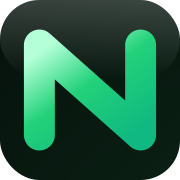

  

  Long-form engineering narratives and source-level walkthroughs — from the team at <a href="https://novaaware.com"><strong>NovaAware</strong></a>.

# novaaware-blog

A collection of **original, in-depth technical articles**: LLM architecture and implementation (Decoder-only Transformers, MoE source code, context extension, model design trade-offs), hands-on integration lessons where they matter, and classic systems topics (data structures, distributed algorithms). Pieces are written as **engineering narratives**—code, math, and production detail—not tool tutorials alone.

Articles in this repository are grouped by **year** and **language**. Choose a locale below to read on GitHub.

---

## 2026

### English (`en`)

| Article | Link |
|--------|------|
| Lessons Learned from Integrating DeepSeek V4 into Various Agents | [Read →](2026/en/deepseek-v4-agent-integration-pitfalls.md) |
| AI-Testing Series (Part 1) — API Test Automation with AI | [Read →](2026/en/ai-testing-api-test-automation-with-ai.md) |
| AI-Testing Series (Part 2) — UI Automation with AI Agents & Visual Recognition | [Read →](2026/en/ai-testing-ui-automation-with-ai-agent.md) |

### Persian / Farsi (`ir`)

| Article | Link |
|--------|------|
| درس‌هایی از یکپارچه‌سازی DeepSeek V4 با ایجنت‌های مختلف | [Read →](2026/ir/deepseek-v4-agent-integration-pitfalls.md) |

---

  More years and languages will be added as translations are published. → <a href="https://novaaware.com">novaaware.com</a>

